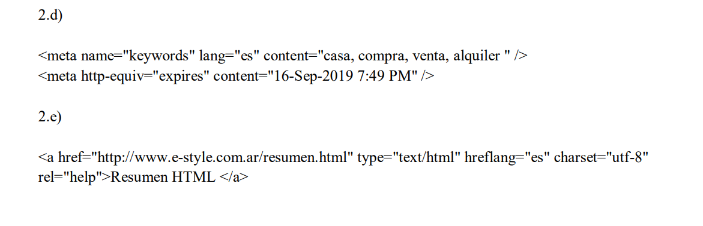

# Ejercicio 2
---

2.a)

Forma de hacer comentarios en HTML en este caso el comentario no esta cerrado

2.b)

- Etiqueta que no tiene ningun efecto cuando se ve en el navegador.
- Se ubica dentro de la etiqueta body.
- Tiene una tributo id que sirve como un identificador unico de una etiqueta HTML (No obligatorio)

2.c)

- Etiqueta que se usa para insertar imagenes en el navegador.
- Va dentro del body.

**Atributos:**

- SRC: Si es obligatorio.

- ALT: No obligatorio .

- NAME: No es obligatorio en esta etiqueta

- WIDTH: No obligatorio

- HEIGHT: No obligatorio

- LONGDESC: No obligatorio

2.d)

- Proporcionan metadatos sobre el documento HTML.
- Va dentro del head.

**Atributos:**

- NAME: No obligatorio.

- LANG: No es obligatorio.

- CONTENT: Si es obligatorio

- HTTP-EQUIV: No es obligatorio

2.e)

